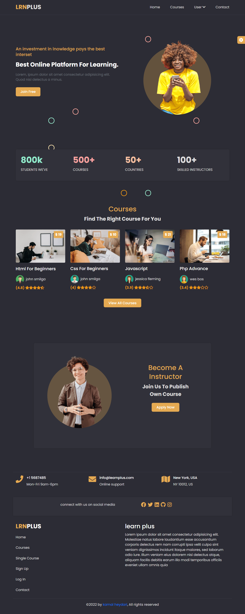
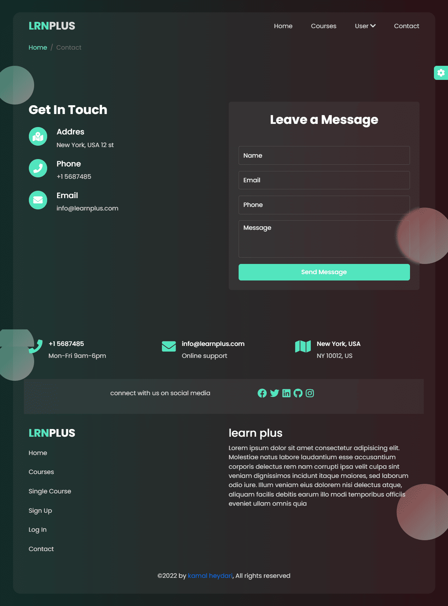
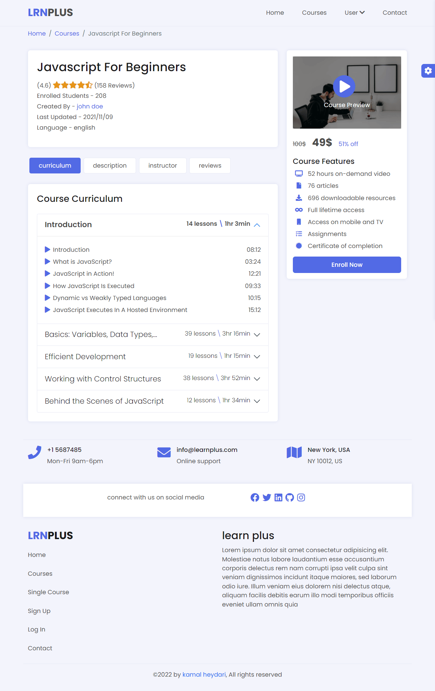
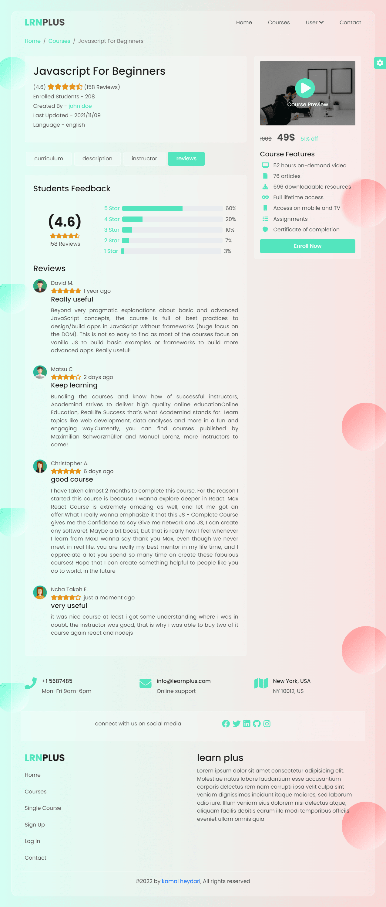
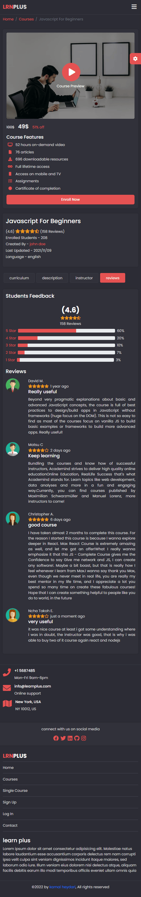

# Learn Plus Template  

## Using
- react
- bootstrap

## Features
The website is suitable for educational purposes, such as university, college, school, online courses, academy, courses, education, education center, tuition, tutoring, business, events, institute, learning, teacher and much more.

The template is 100% responsive and fits perfectly on various displays and resolutions from regular desktop screens to tablets, iPads, iPhones, and small mobile devices.

Template Features
- Based on Bootstrap 5.x
- 6 Pages
- Modern and clean design
- 100% Responsive
- Live Style Switcher
- 5 Preset Colors (all colors can be customized)
- Light/Dark mode
- Glassmorphism design

## Demo
See demo on github pages
[React Bootstrap Multipage](https://kamalheydari.github.io/react-bootstrap-multipage-learnplus)

